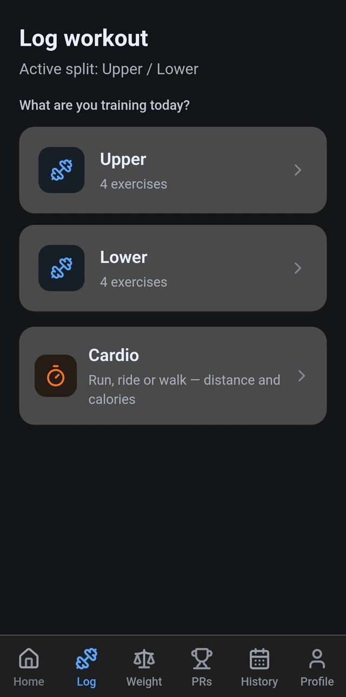
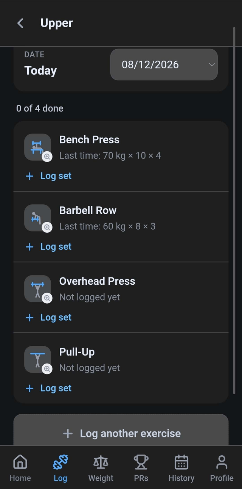
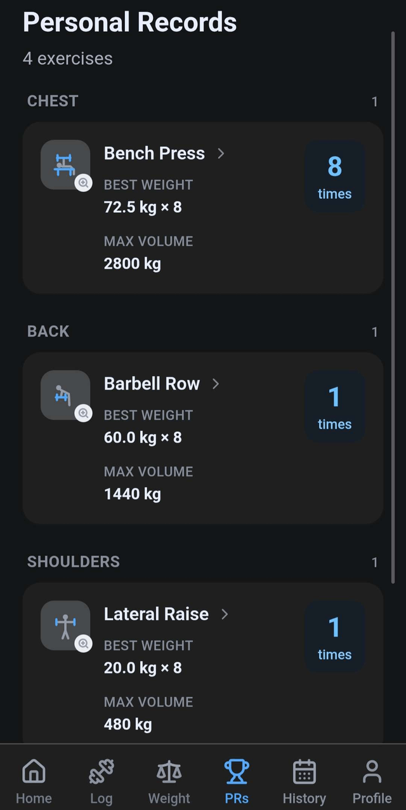
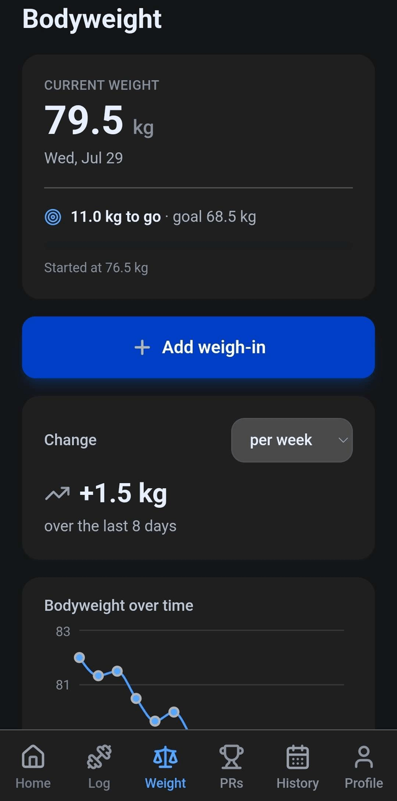
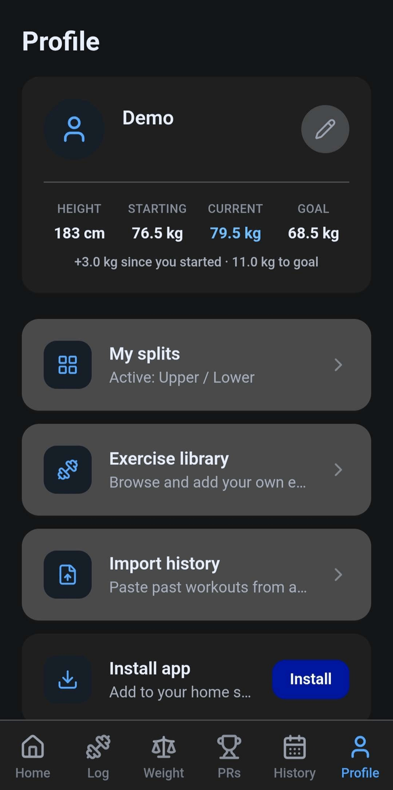

# Family Fitness

A mobile-first workout tracker built for my family to share — logging, personal
records, bodyweight trends and cardio, installable to the home screen as a PWA.

Each family member gets their own private account. All data is isolated per user
at the database level, not in the UI.

**Stack:** React 19 · TypeScript · Vite · Tailwind v4 · Supabase (Postgres + Auth + RLS) · Recharts · Workbox

---

## Screenshots

<table>
  <tr>
    <td align="center" width="33%">
      <br>
      <sub><b>Pick a day</b><br>Your active split, plus cardio</sub>
    </td>
    <td align="center" width="33%">
      <br>
      <sub><b>Log a session</b><br>Per-set entry, prefilled from last time</sub>
    </td>
    <td align="center" width="33%">
      <br>
      <sub><b>Personal records</b><br>Grouped by body area, computed by trigger</sub>
    </td>
  </tr>
  <tr>
    <td align="center">
      <br>
      <sub><b>Bodyweight</b><br>Progress toward a goal, with trend</sub>
    </td>
    <td align="center">
      <br>
      <sub><b>Profile</b><br>Current weight and progress at a glance</sub>
    </td>
    <td></td>
  </tr>
</table>

<sub>Captured from a demo account with sample data.</sub>

---

## Features

- **Workout logging** — build a split (Push/Pull/Legs, Upper/Lower, or your own),
  then log per-set: each set records its own weight and reps, so pyramids and drop
  sets are captured accurately.
- **Personal records** — computed by database trigger from your logs, grouped by
  body area, with a celebration when you beat one.
- **Progress charts** — per-exercise weight and volume over time, plus bodyweight
  tracking against a goal.
- **Cardio** — speed, incline and duration in; distance, pace and estimated
  calories out.
- **Dashboard** — weekly workout goal, training streak, an 8-week trend that
  toggles between volume / calories / cardio, and a breakdown of what time of day
  you actually train.
- **Offline-capable PWA** — installable, works without a connection, with a rest
  timer that survives navigation and fires a notification when it finishes.
- Dark mode, CSV import from a spreadsheet, password reset.

---

## Architecture notes

The decisions I'd want to talk through in a review:

**Security is enforced in the database, not the client.** Every table has RLS
enabled with policies scoped to `user_id = auth.uid()`, plus explicit grants to
the `authenticated` role. The client deliberately queries without user filters
(`.select('*')`) and lets Postgres do the scoping — so a bug in a component can't
widen access. See [`supabase/`](supabase/) for every policy.

**Derived values are database-generated.** `workout_logs.volume` and
`cardio_logs.distance_km` are `GENERATED ALWAYS ... STORED`, so a client can't
write a figure that disagrees with its inputs — attempts are rejected outright.
Personal records are maintained by triggers rather than trusted from the client.

**History survives deletion.** Logs store both `exercise_id` (nullable FK) and an
`exercise_name` snapshot, so deleting a custom exercise leaves past workouts
readable instead of orphaned.

**Ordering is renumbered, not swapped.** Reordering a split rewrites positions as
`0..n-1`. An earlier swap-two-values approach silently no-opped whenever two rows
shared a position, and renumbering also repairs any list it touches.

**Dates are local, never UTC.** `toISOString()` would file a late-evening workout
under tomorrow for anyone east of Greenwich, so all date maths goes through
local-calendar helpers.

**Streaks are weekly, not daily.** Strength programs schedule rest days; a
consecutive-day streak punishes training correctly. A week counts if it contains
at least one session.

**Time-of-day uses a circular mean.** Clock time wraps, so averaging raw minutes
puts sessions at 23:00 and 01:00 at *noon* — the one time neither happened.
Averaging unit vectors on the 24-hour circle handles midnight properly.

**Exercise diagrams are hand-authored SVG**
([`src/lib/exerciseArt.tsx`](src/lib/exerciseArt.tsx)) rather than stock photos:
~10 KB for the whole set, sharp at any size, works offline, and inherits the text
colour so it adapts to dark mode for free. Custom exercises get a diagram
automatically via ordered keyword matching on the name, falling back to muscle
group — so nothing ever renders blank.

**Calorie estimates use the ACSM metabolic equations**, so incline and bodyweight
genuinely change the result rather than being decorative. Always presented as
estimates.

---

## Running it locally

```bash
npm install
```

Create a Supabase project, then run the SQL files in [`supabase/`](supabase/) in
order (`phase1` → `phase9`) in the Supabase SQL Editor. Each is commented and safe
to re-run.

Copy the env template and fill in your own project values:

```bash
cp .env.example .env.local
```

```
VITE_SUPABASE_URL=https://<your-project>.supabase.co
VITE_SUPABASE_ANON_KEY=<your anon key>
```

The anon key is a public, browser-shipped key — access control comes from RLS, not
from hiding it. Never put a `service_role` key in this file.

```bash
npm run dev
```

See [SETUP.md](SETUP.md) for the full walkthrough and [DEPLOY.md](DEPLOY.md) for
deploying to Vercel.

---

## Project layout

```
src/
  components/   UI building blocks (steppers, sheets, charts, timer)
  contexts/     auth, theme, rest timer
  lib/          data access + domain logic (logs, PRs, cardio, calories, art)
  pages/        one file per route
supabase/       numbered, commented SQL migrations
```

## Licence

MIT — see [LICENSE](LICENSE).
